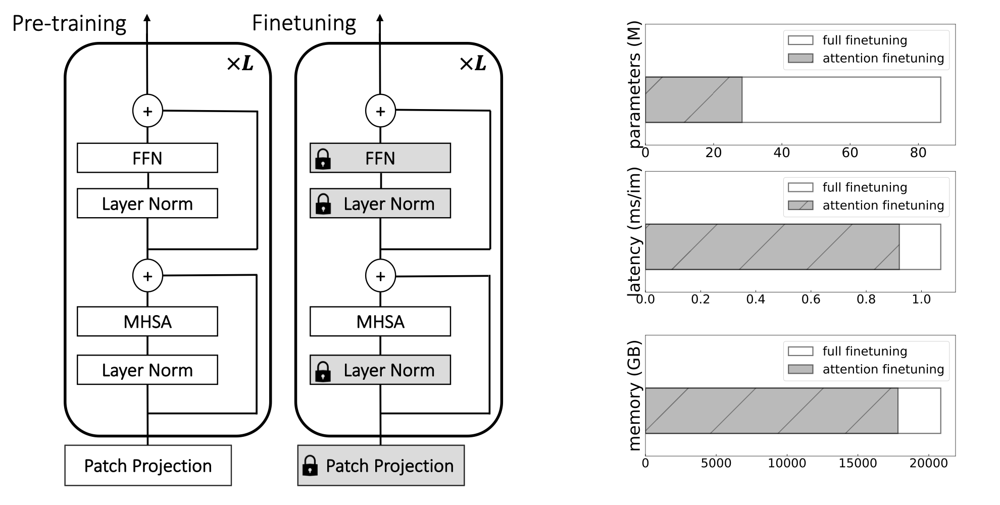
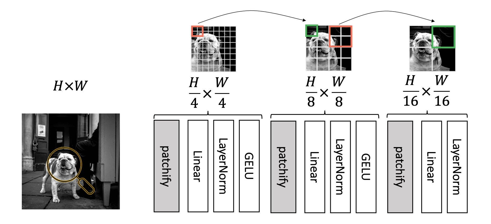
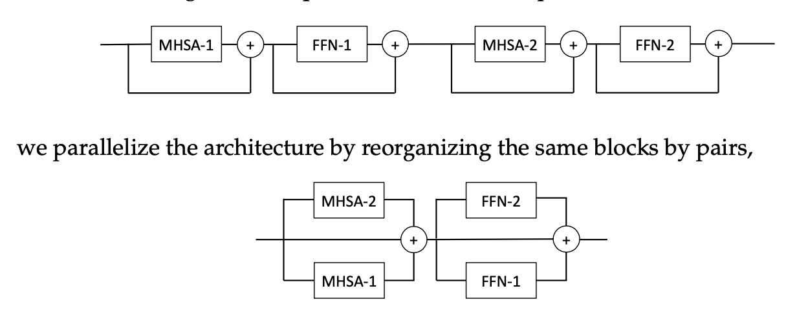

# Three things everyone should know about Vision Transformers

This repository contains PyTorch evaluation code, training code and pretrained models for the following projects:
* [DeiT](README_deit.md) (Data-Efficient Image Transformers), ICML 2021 
* [CaiT](README_cait.md) (Going deeper with Image Transformers), ICCV 2021 (Oral)
* [ResMLP](README_resmlp.md) (ResMLP: Feedforward networks for image classification with data-efficient training)
* [PatchConvnet](README_patchconvnet.md) (Augmenting Convolutional networks with attention-based aggregation)
* 3Things (Three things everyone should know about Vision Transformers)
* [DeiT III](README_revenge.md) (DeiT III: Revenge of the ViT)


For details see [Three things everyone should know about Vision Transformers](https://arxiv.org/pdf/2203.09795) by Hugo Touvron, Matthieu Cord, Alaaeldin El-Nouby, Jakob Verbeek and Hervé Jégou. 

If you use this code for a paper please cite:

```
@article{Touvron2022ThreeTE,
  title={Three things everyone should know about Vision Transformers},
  author={Hugo Touvron and Matthieu Cord and Alaaeldin El-Nouby and Jakob Verbeek and Herve Jegou},
  journal={arXiv preprint arXiv:2203.09795},
  year={2022},
}
```


## Attention only fine-tuning

We propose to finetune only the attentions (flag ```--attn-only```) to adapt the models to higher resolutions or to do transfer learning.




## MLP patch projection
We propose to replace the linear patch projection by an MLP patch projection (see class [hMLP_stem](models_v2.py)). A key advantage is that this pre-processing stem is compatible with and improves mask-based self-supervised training like BeiT.  




## Parallel blocks

We propose to use block in parallele in order to have more flexible architectures (see class [Layer_scale_init_Block_paralx2](models_v2.py)):




# License
This repository is released under the Apache 2.0 license as found in the [LICENSE](LICENSE) file.

# Contributing
We actively welcome your pull requests! Please see [CONTRIBUTING.md](.github/CONTRIBUTING.md) and [CODE_OF_CONDUCT.md](.github/CODE_OF_CONDUCT.md) for more info.

