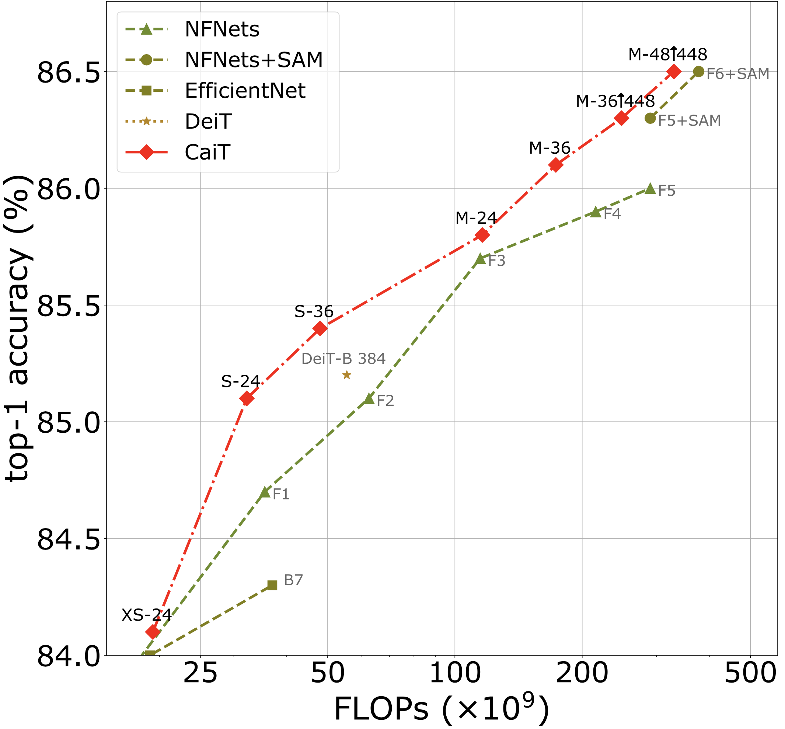

# CaiT: Going deeper with Image Transformers 

This repository contains PyTorch evaluation code, training code and pretrained models for:
* [DeiT](README_deit.md) (Data-Efficient Image Transformers), ICML 2021
* CaiT (Going deeper with Image Transformers), ICCV 2021 (Oral)
* [ResMLP](README_resmlp.md) (ResMLP: Feedforward networks for image classification with data-efficient training) 
* [PatchConvnet](README_patchconvnet.md) (Augmenting Convolutional networks with attention-based aggregation)
* [3Things](README_3things.md) (Three things everyone should know about Vision Transformers)
* [DeiT III](README_revenge.md) (DeiT III: Revenge of the ViT)

CaiT obtain competitive tradeoffs in terms of flops / precision:

<p align="center">
  
</p>

For details see [Going deeper with Image Transformers](https://arxiv.org/abs/2103.17239) by Hugo Touvron, Matthieu Cord, Alexandre Sablayrolles, Gabriel Synnaeve and Hervé Jégou

If you use this code for a paper please cite:

```
@InProceedings{Touvron_2021_ICCV,
    author    = {Touvron, Hugo and Cord, Matthieu and Sablayrolles, Alexandre and Synnaeve, Gabriel and J\'egou, Herv\'e},
    title     = {Going Deeper With Image Transformers},
    booktitle = {Proceedings of the IEEE/CVF International Conference on Computer Vision (ICCV)},
    month     = {October},
    year      = {2021},
    pages     = {32-42}
}
```

# Model Zoo

We provide baseline CaiT models pretrained on ImageNet1k 2012 only, using the distilled version of our method.

| name | acc@1 | res | FLOPs| #params | url |
| --- | --- | --- | --- | --- | --- | 
| S24 | 83.5 | 224 |9.4B| 47M| [model](https://dl.fbaipublicfiles.com/deit/S24_224.pth) |
| XS24| 84.1 | 384 |  19.3B |27M | [model](https://dl.fbaipublicfiles.com/deit/XS24_384.pth) |
| S24 | 85.1 | 384 |  32.2B |47M | [model](https://dl.fbaipublicfiles.com/deit/S24_384.pth) |
| S36 | 85.4 | 384 | 48.0B| 68M| [model](https://dl.fbaipublicfiles.com/deit/S36_384.pth) |
| M36 | 86.1 | 384 |  173.3B| 271M | [model](https://dl.fbaipublicfiles.com/deit/M36_384.pth) |
| M48 | 86.5 | 448 |  329.6B| 356M | [model](https://dl.fbaipublicfiles.com/deit/M48_448.pth) |


The models are also available via torch hub.
Before using it, make sure you have the pytorch-image-models package [`timm==0.3.2`](https://github.com/rwightman/pytorch-image-models) by [Ross Wightman](https://github.com/rwightman) installed. 

# Evaluation transforms

CaiT employs a slightly different pre-processing, in particular a crop-ratio of 1.0 at test time. To reproduce the results of our paper please use the following pre-processing:

```
def get_test_transforms(input_size):
    mean, std = [0.485, 0.456, 0.406],[0.229, 0.224, 0.225]    
    transformations = {}
    transformations= transforms.Compose(
        [transforms.Resize(input_size, interpolation=3),
         transforms.CenterCrop(input_size),
         transforms.ToTensor(),
         transforms.Normalize(mean, std)])
    return transformations
 ```  

Remark: for CaiT M48 it is best to evaluate with FP32 precision

### Other: Unofficial Implementations

 - [TensorFlow](https://github.com/sayakpaul/cait-tf) by [Sayak Paul](https://github.com/sayakpaul)
 
# License
This repository is released under the Apache 2.0 license as found in the [LICENSE](LICENSE) file.

# Contributing
We actively welcome your pull requests! Please see [CONTRIBUTING.md](.github/CONTRIBUTING.md) and [CODE_OF_CONDUCT.md](.github/CODE_OF_CONDUCT.md) for more info.
