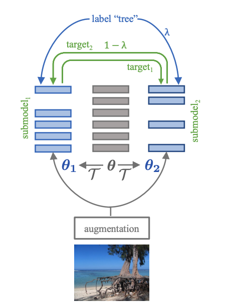

# Co-training 2L Submodels for Visual Recognition

This repository contains PyTorch evaluation code, training code and pretrained models for the following projects:
* [DeiT](README_deit.md) (Data-Efficient Image Transformers), ICML 2021 
* [CaiT](README_cait.md) (Going deeper with Image Transformers), ICCV 2021 (Oral)
* [ResMLP](README_resmlp.md) (ResMLP: Feedforward networks for image classification with data-efficient training)
* [PatchConvnet](README_patchconvnet.md) (Augmenting Convolutional networks with attention-based aggregation)
* [3Things](README_3things.md) (Three things everyone should know about Vision Transformers)
* [DeiT III](README_revenge.md) (DeiT III: Revenge of the ViT)
* Cosub (Co-training 2L Submodels for Visual Recognition)

This new training recipes improve previous training strategy with different architectures:



For details see [Co-training 2L Submodels for Visual Recognition](https://arxiv.org/pdf/2212.04884.pdf) by Hugo Touvron, Matthieu Cord, Maxime Oquab, Piotr Bojanowski, Jakob Verbeek and Hervé Jégou. 

If you use this code for a paper please cite:

```
@article{Touvron2022Cotraining2S,
  title={Co-training 2L Submodels for Visual Recognition},
  author={Hugo Touvron and Matthieu Cord and Maxime Oquab and Piotr Bojanowski and Jakob Verbeek and Herv'e J'egou},
  journal={arXiv preprint arXiv:2212.04884},
  year={2022},
}
```
