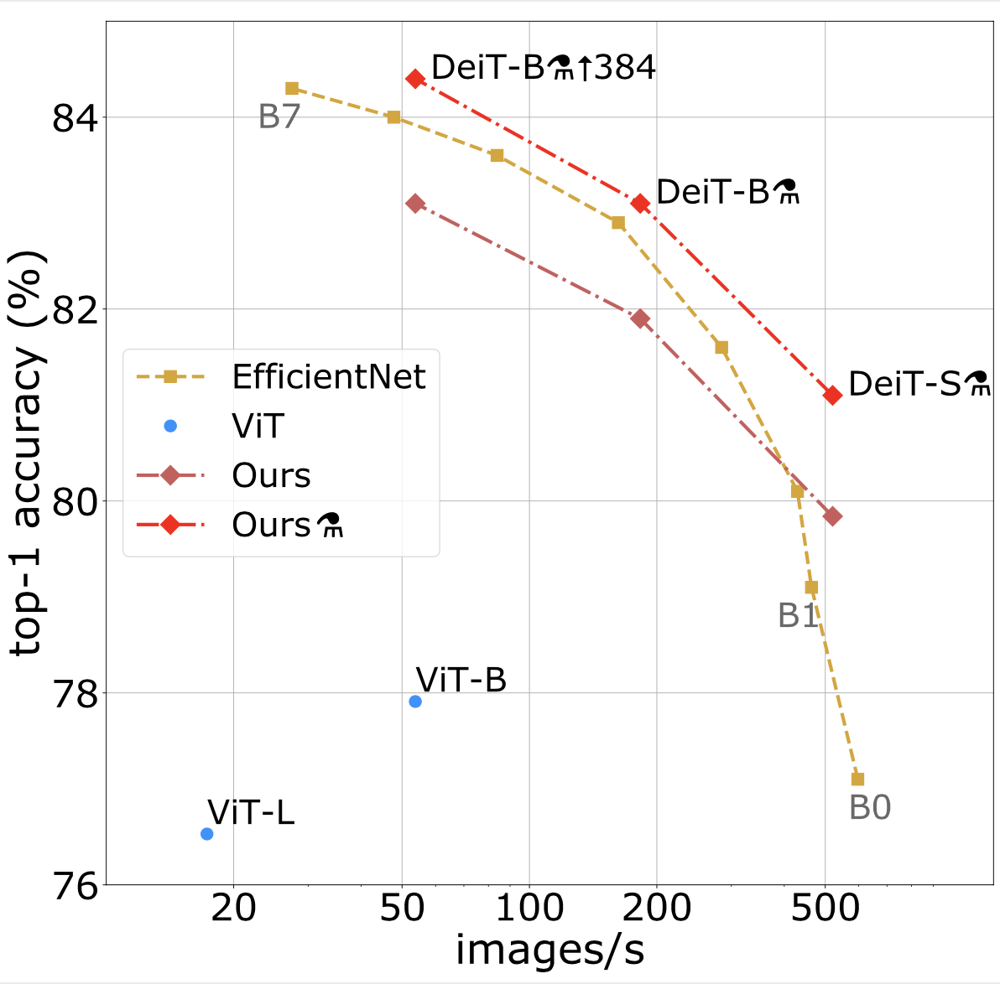

# DeiT: Data-efficient Image Transformers

This repository contains PyTorch evaluation code, training code and pretrained models for the following projects:
* DeiT (Data-Efficient Image Transformers), ICML 2021 
* [CaiT](README_cait.md) (Going deeper with Image Transformers), ICCV 2021 (Oral)
* [ResMLP](README_resmlp.md) (ResMLP: Feedforward networks for image classification with data-efficient training)
* [PatchConvnet](README_patchconvnet.md) (Augmenting Convolutional networks with attention-based aggregation)
* [3Things](README_3things.md) (Three things everyone should know about Vision Transformers)
* [DeiT III](README_revenge.md) (DeiT III: Revenge of the ViT)

They obtain competitive tradeoffs in terms of speed / precision:



For details see [Training data-efficient image transformers & distillation through attention](https://arxiv.org/abs/2012.12877) by Hugo Touvron, Matthieu Cord, Matthijs Douze, Francisco Massa, Alexandre Sablayrolles and Hervé Jégou. 

If you use this code for a paper please cite:

```
@InProceedings{pmlr-v139-touvron21a,
  title =     {Training data-efficient image transformers &amp; distillation through attention},
  author =    {Touvron, Hugo and Cord, Matthieu and Douze, Matthijs and Massa, Francisco and Sablayrolles, Alexandre and Jegou, Herve},
  booktitle = {International Conference on Machine Learning},
  pages =     {10347--10357},
  year =      {2021},
  volume =    {139},
  month =     {July}
}
```

# Model Zoo

We provide baseline DeiT models pretrained on ImageNet 2012.

| name | acc@1 | acc@5 | #params | url |
| --- | --- | --- | --- | --- |
| DeiT-tiny | 72.2 | 91.1 | 5M | [model](https://dl.fbaipublicfiles.com/deit/deit_tiny_patch16_224-a1311bcf.pth) |
| DeiT-small | 79.9 | 95.0 | 22M| [model](https://dl.fbaipublicfiles.com/deit/deit_small_patch16_224-cd65a155.pth) |
| DeiT-base | 81.8 | 95.6 | 86M | [model](https://dl.fbaipublicfiles.com/deit/deit_base_patch16_224-b5f2ef4d.pth) |
| DeiT-tiny distilled | 74.5 | 91.9 | 6M | [model](https://dl.fbaipublicfiles.com/deit/deit_tiny_distilled_patch16_224-b40b3cf7.pth) |
| DeiT-small distilled | 81.2 | 95.4 | 22M| [model](https://dl.fbaipublicfiles.com/deit/deit_small_distilled_patch16_224-649709d9.pth) |
| DeiT-base distilled | 83.4 | 96.5 | 87M | [model](https://dl.fbaipublicfiles.com/deit/deit_base_distilled_patch16_224-df68dfff.pth) |
| DeiT-base 384 | 82.9 | 96.2 | 87M | [model](https://dl.fbaipublicfiles.com/deit/deit_base_patch16_384-8de9b5d1.pth) |
| DeiT-base distilled 384 (1000 epochs) | 85.2 | 97.2 | 88M | [model](https://dl.fbaipublicfiles.com/deit/deit_base_distilled_patch16_384-d0272ac0.pth) |
|CaiT-S24 distilled 384| 85.1 | 97.3 | 47M | [model](README_cait.md)|
|CaiT-M48 distilled 448| 86.5 | 97.7 | 356M | [model](README_cait.md)|

The models are also available via torch hub.
Before using it, make sure you have the pytorch-image-models package [`timm==0.3.2`](https://github.com/rwightman/pytorch-image-models) by [Ross Wightman](https://github.com/rwightman) installed. Note that our work relies of the augmentations proposed in this library. In particular, the RandAugment and RandErasing augmentations that we invoke are the improved versions from the timm library, which already led the timm authors to report up to 79.35% top-1 accuracy with Imagenet training for their best model, i.e., an improvement of about +1.5% compared to prior art. 

To load DeiT-base with pretrained weights on ImageNet simply do:

```python
import torch
# check you have the right version of timm
import timm
assert timm.__version__ == "0.3.2"

# now load it with torchhub
model = torch.hub.load('facebookresearch/deit:main', 'deit_base_patch16_224', pretrained=True)
```

Additionnally, we provide a [Colab notebook](https://colab.research.google.com/github/facebookresearch/deit/blob/colab/notebooks/deit_inference.ipynb) which goes over the steps needed to perform inference with DeiT.

# Usage

First, clone the repository locally:
```
git clone https://github.com/facebookresearch/deit.git
```
Then, install PyTorch 1.7.0+ and torchvision 0.8.1+ and [pytorch-image-models 0.3.2](https://github.com/rwightman/pytorch-image-models):

```
conda install -c pytorch pytorch torchvision
pip install timm==0.3.2
```

## Data preparation

Download and extract ImageNet train and val images from http://image-net.org/.
The directory structure is the standard layout for the torchvision [`datasets.ImageFolder`](https://pytorch.org/docs/stable/torchvision/datasets.html#imagefolder), and the training and validation data is expected to be in the `train/` folder and `val` folder respectively:

```
/path/to/imagenet/
  train/
    class1/
      img1.jpeg
    class2/
      img2.jpeg
  val/
    class1/
      img3.jpeg
    class2/
      img4.jpeg
```

## Evaluation
To evaluate a pre-trained DeiT-base on ImageNet val with a single GPU run:
```
python main.py --eval --resume https://dl.fbaipublicfiles.com/deit/deit_base_patch16_224-b5f2ef4d.pth --data-path /path/to/imagenet
```
This should give
```
* Acc@1 81.846 Acc@5 95.594 loss 0.820
```

For Deit-small, run:
```
python main.py --eval --resume https://dl.fbaipublicfiles.com/deit/deit_small_patch16_224-cd65a155.pth --model deit_small_patch16_224 --data-path /path/to/imagenet
```
giving
```
* Acc@1 79.854 Acc@5 94.968 loss 0.881
```

Note that Deit-small is *not* the same model as in Timm. 

And for Deit-tiny:
```
python main.py --eval --resume https://dl.fbaipublicfiles.com/deit/deit_tiny_patch16_224-a1311bcf.pth --model deit_tiny_patch16_224 --data-path /path/to/imagenet
```
which should give
```
* Acc@1 72.202 Acc@5 91.124 loss 1.219
```

Here you'll find the command-lines to reproduce the inference results for the distilled and finetuned models

<details>

<summary>
deit_base_distilled_patch16_224
</summary>

```
python main.py --eval --model deit_base_distilled_patch16_224 --resume https://dl.fbaipublicfiles.com/deit/deit_base_distilled_patch16_224-df68dfff.pth
```
giving
```
* Acc@1 83.372 Acc@5 96.482 loss 0.685
```

</details>


<details>

<summary>
deit_small_distilled_patch16_224
</summary>

```
python main.py --eval --model deit_small_distilled_patch16_224 --resume https://dl.fbaipublicfiles.com/deit/deit_small_distilled_patch16_224-649709d9.pth
```
giving
```
* Acc@1 81.164 Acc@5 95.376 loss 0.752
```

</details>

<details>

<summary>
deit_tiny_distilled_patch16_224
</summary>

```
python main.py --eval --model deit_tiny_distilled_patch16_224 --resume https://dl.fbaipublicfiles.com/deit/deit_tiny_distilled_patch16_224-b40b3cf7.pth
```
giving
```
* Acc@1 74.476 Acc@5 91.920 loss 1.021
```

</details>

<details>

<summary>
deit_base_patch16_384
</summary>

```
python main.py --eval --model deit_base_patch16_384 --input-size 384 --resume https://dl.fbaipublicfiles.com/deit/deit_base_patch16_384-8de9b5d1.pth
```
giving
```
* Acc@1 82.890 Acc@5 96.222 loss 0.764
```

</details>

<details>

<summary>
deit_base_distilled_patch16_384
</summary>

```
python main.py --eval --model deit_base_distilled_patch16_384 --input-size 384 --resume https://dl.fbaipublicfiles.com/deit/deit_base_distilled_patch16_384-d0272ac0.pth
```
giving
```
* Acc@1 85.224 Acc@5 97.186 loss 0.636
```

</details>

## Training
To train DeiT-small and Deit-tiny on ImageNet on a single node with 4 gpus for 300 epochs run:

DeiT-small
```
python -m torch.distributed.launch --nproc_per_node=4 --use_env main.py --model deit_small_patch16_224 --batch-size 256 --data-path /path/to/imagenet --output_dir /path/to/save
```

DeiT-tiny
```
python -m torch.distributed.launch --nproc_per_node=4 --use_env main.py --model deit_tiny_patch16_224 --batch-size 256 --data-path /path/to/imagenet --output_dir /path/to/save
```


### Multinode training

Distributed training is available via Slurm and [submitit](https://github.com/facebookincubator/submitit):

```
pip install submitit
```

To train DeiT-base model on ImageNet on 2 nodes with 8 gpus each for 300 epochs:

```
python run_with_submitit.py --model deit_base_patch16_224 --data-path /path/to/imagenet
```

To train DeiT-base with hard distillation using a RegNetY-160 as teacher, on 2 nodes with 8 GPUs with 32GB each for 300 epochs (make sure that the model weights for the teacher have been downloaded before to the correct location, to avoid multiple workers writing to the same file):
```
python run_with_submitit.py --model deit_base_distilled_patch16_224 --distillation-type hard --teacher-model regnety_160 --teacher-path https://dl.fbaipublicfiles.com/deit/regnety_160-a5fe301d.pth --use_volta32
```

To finetune a DeiT-base on 384 resolution images for 30 epochs, starting from a DeiT-base trained on 224 resolution images, do (make sure that the weights to the original model have been downloaded before, to avoid multiple workers writing to the same file):
```
python run_with_submitit.py --model deit_base_patch16_384 --batch-size 32 --finetune https://dl.fbaipublicfiles.com/deit/deit_base_patch16_224-b5f2ef4d.pth --input-size 384 --use_volta32 --nodes 2 --lr 5e-6 --weight-decay 1e-8 --epochs 30 --min-lr 5e-6
```

### Other: Unofficial Implementations and Tutorial

 - [TensorFlow](https://github.com/sayakpaul/deit-tf) by [Sayak Paul](https://github.com/sayakpaul)
 - [Tutorial](https://github.com/sayakpaul/probing-vits/) by [Aritra Roy Gosthipaty](https://github.com/ariG23498) and [Sayak Paul](https://github.com/sayakpaul)


# License
This repository is released under the Apache 2.0 license as found in the [LICENSE](LICENSE) file.

# Contributing
We actively welcome your pull requests! Please see [CONTRIBUTING.md](.github/CONTRIBUTING.md) and [CODE_OF_CONDUCT.md](.github/CODE_OF_CONDUCT.md) for more info.
