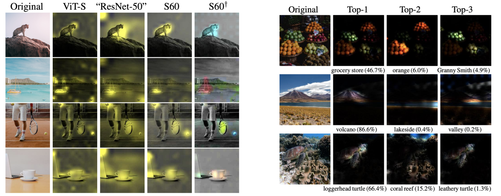

# Augmenting Convolutional networks with attention-based aggregation

This repository contains PyTorch evaluation code, training code and pretrained models for the following projects:
* [DeiT](README.md) (Data-Efficient Image Transformers), ICML 2021 
* [CaiT](README_cait.md) (Going deeper with Image Transformers), ICCV 2021 (Oral)
* [ResMLP](README_resmlp.md) (ResMLP: Feedforward networks for image classification with data-efficient training)
* PatchConvnet (Augmenting Convolutional networks with attention-based aggregation)

PatchConvnet provides interpretable attention maps to convnets:

<p align="center">
  
</p>

For details see [Augmenting Convolutional networks with attention-based aggregation](https://arxiv.org/abs/2112.13692) by Hugo Touvron, Matthieu Cord, Alaaeldin El-Nouby, Matthieu Cord, Piotr Bojanowski, Armand Joulin, Gabriel Synnaeve and Hervé Jégou.

If you use this code for a paper please cite:

```
@article{touvron2021patchconvnet,
  title={Augmenting Convolutional networks with attention-based aggregation},
  author={Hugo Touvron and Matthieu Cord and Alaaeldin El-Nouby and Piotr Bojanowski and Armand Joulin and Gabriel Synnaeve and Jakob Verbeek and Herv'e J'egou},
  journal={arXiv preprint arXiv:2112.13692},
  year={2021},
}
```

# Model Zoo

We provide PatchConvnet models pretrained on ImageNet-1k:

| name | acc@1 | res | FLOPs| #params | url |
| --- | --- | --- | --- | --- | --- | 
| S60 | 82.1 | 224 |4.0B| 25.2M| [model](https://dl.fbaipublicfiles.com/deit/s60_224_1k.pth) |
| S120| 83.2 | 224 |  7.5B |47.7M | [model](https://dl.fbaipublicfiles.com/deit/s120_224_1k.pth) |
| B60 | 83.5 | 224 |  15.8B |99.4M | [model](https://dl.fbaipublicfiles.com/deit/b60_224_1k.pth) |
| B120 |84.1 | 224 |  29.9B |188.6M | [model](https://dl.fbaipublicfiles.com/deit/b120_224_1k.pth) |

Model pretrained on ImageNet-21k with finetuning on ImageNet-1k:

| name | acc@1 | res | FLOPs| #params | url |
| --- | --- | --- | --- | --- | --- | 
| S60 |83.5 | 224 |  4.0B |25.2M |[model](https://dl.fbaipublicfiles.com/deit/s60_224_21k.pth) |
| S60 |84.9 | 384 |  11.8B |25.2M |[model](https://dl.fbaipublicfiles.com/deit/s60_384_21k.pth) |
| S60 |85.4 | 512 |  20.9B |25.2M |[model](https://dl.fbaipublicfiles.com/deit/s60_512_21k.pth) |
| B60 |85.4 | 224 |  15.8B |99.4M |[model](https://dl.fbaipublicfiles.com/deit/b60_224_21k.pth) |
| B60 |86.5 | 384 |  46.5B |99.4M |[model](https://dl.fbaipublicfiles.com/deit/b60_384_21k.pth) |
| B120 |86.0 | 224 |  29.8B |188.6M |[model](https://dl.fbaipublicfiles.com/deit/b120_224_21k.pth) |
| B120 |86.9 | 384 |  87.7B |188.6M |[model](https://dl.fbaipublicfiles.com/deit/b120_384_21k.pth) |

PatchConvnet models with multi-class tokens on ImageNet-1k:

| name | acc@1 | res | FLOPs| #params | url |
| --- | --- | --- | --- | --- | --- | 
| S60 (scratch)|81.1 | 224 |  5.3B |25.6M |[model](https://dl.fbaipublicfiles.com/deit/s60_multi_scratch_1k.pth) |
| S60 (finetune)|82.0 | 224 |  5.3B |25.6M |[model](https://dl.fbaipublicfiles.com/deit/s60_multi_finetune_1k.pth) |


The models are also available via torch hub.
Before using it, make sure you have the latest pytorch-image-models package [`timm`](https://github.com/rwightman/pytorch-image-models) by [Ross Wightman](https://github.com/rwightman) installed. 


# License
This repository is released under the Apache 2.0 license as found in the [LICENSE](LICENSE) file.

# Contributing
We actively welcome your pull requests! Please see [CONTRIBUTING.md](.github/CONTRIBUTING.md) and [CODE_OF_CONDUCT.md](.github/CODE_OF_CONDUCT.md) for more info.
