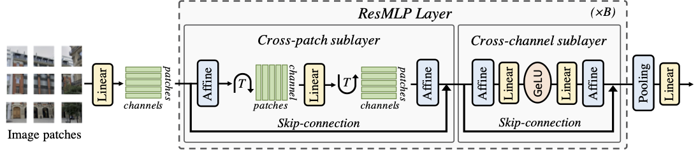

# ResMLP: Feedforward networks for image classification with data-efficient training

This repository contains PyTorch evaluation code, training code and pretrained models for the following projects:
* [DeiT](README_deit.md) (Data-Efficient Image Transformers), ICML 2021 
* [CaiT](README_cait.md) (Going deeper with Image Transformers), ICCV 2021 (Oral)
* ResMLP (ResMLP: Feedforward networks for image classification with data-efficient training)
* [PatchConvnet](README_patchconvnet.md) (Augmenting Convolutional networks with attention-based aggregation)
* [3Things](README_3things.md) (Three things everyone should know about Vision Transformers)
* [DeiT III](README_revenge.md) (DeiT III: Revenge of the ViT)

ResMLP obtain good performance given its simplicity:

<p align="center">
  
</p>

For details see [ResMLP: Feedforward networks for image classification with data-efficient training](https://arxiv.org/abs/2105.03404) by Hugo Touvron, Piotr Bojanowski, Mathilde Caron, Matthieu Cord, Alaaeldin El-Nouby, Edouard Grave, Gautier Izacard, Armand Joulin, Gabriel Synnaeve, Jakob Verbeek and Hervé Jégou.

If you use this code for a paper please cite:

```
@article{touvron2021resmlp,
  title={ResMLP: Feedforward networks for image classification with data-efficient training},
  author={Hugo Touvron and Piotr Bojanowski and Mathilde Caron and Matthieu Cord and Alaaeldin El-Nouby and Edouard Grave and Gautier Izacard and Armand Joulin and Gabriel Synnaeve and Jakob Verbeek and Herv'e J'egou},
  journal={arXiv preprint arXiv:2105.03404},
  year={2021},
}
```

# Model Zoo

We provide baseline ResMLP models pretrained on ImageNet1k 2012, using the distilled version of our method:

| name | acc@1 | res | FLOPs| #params | url |
| --- | --- | --- | --- | --- | --- | 
| ResMLP-S12 | 77.8 | 224 |3B| 15M| [model](https://dl.fbaipublicfiles.com/deit/resmlp_12_dist.pth) |
| ResMLP-S24| 80.8 | 224 |  6B |30M | [model](https://dl.fbaipublicfiles.com/deit/resmlp_24_dist.pth) |
| ResMLP-S36 | 81.1 | 224 |  23B |116M | [model](https://dl.fbaipublicfiles.com/deit/resmlp_36_dist.pth) |
| ResMLP-B24 |83.6 | 224 |  100B |129M | [model](https://dl.fbaipublicfiles.com/deit/resmlpB_24_dist.pth) |

Model pretrained on ImageNet-22k with finetuning on ImageNet1k 2012:

| name | acc@1 | res | FLOPs| #params | url |
| --- | --- | --- | --- | --- | --- | 
| ResMLP-B24 |84.4 | 224 |  100B |129M | [model](https://dl.fbaipublicfiles.com/deit/resmlpB_24_22k.pth) |

Models pretrained with DINO without finetuning:

| name | acc@1 (knn)| res | FLOPs| #params | url |
| --- | --- | --- | --- | --- | --- | 
| ResMLP-S12 | 62.6 | 224 |3B| 15M| [model](https://dl.fbaipublicfiles.com/deit/resmlp_12_dino.pth) |
| ResMLP-S24| 69.4 | 224 |  6B |30M | [model](https://dl.fbaipublicfiles.com/deit/resmlp_24_dino.pth) |

The models are also available via torch hub.
Before using it, make sure you have the pytorch-image-models package [`timm==0.3.2`](https://github.com/rwightman/pytorch-image-models) by [Ross Wightman](https://github.com/rwightman) installed. 

# Evaluation transforms

ResMLP employs a slightly different pre-processing, in particular a crop-ratio of 0.9 at test time. To reproduce the results of our paper please use the following pre-processing:

```
def get_test_transforms(input_size):
    mean, std = [0.485, 0.456, 0.406],[0.229, 0.224, 0.225]    
    transformations = {}
    Rs_size=int(input_size/0.9)
    transformations= transforms.Compose(
        [transforms.Resize(Rs_size, interpolation=3),
         transforms.CenterCrop(input_size),
         transforms.ToTensor(),
         transforms.Normalize(mean, std)])
    return transformations
 ```  

# License
This repository is released under the Apache 2.0 license as found in the [LICENSE](LICENSE) file.

# Contributing
We actively welcome your pull requests! Please see [CONTRIBUTING.md](.github/CONTRIBUTING.md) and [CODE_OF_CONDUCT.md](.github/CODE_OF_CONDUCT.md) for more info.
