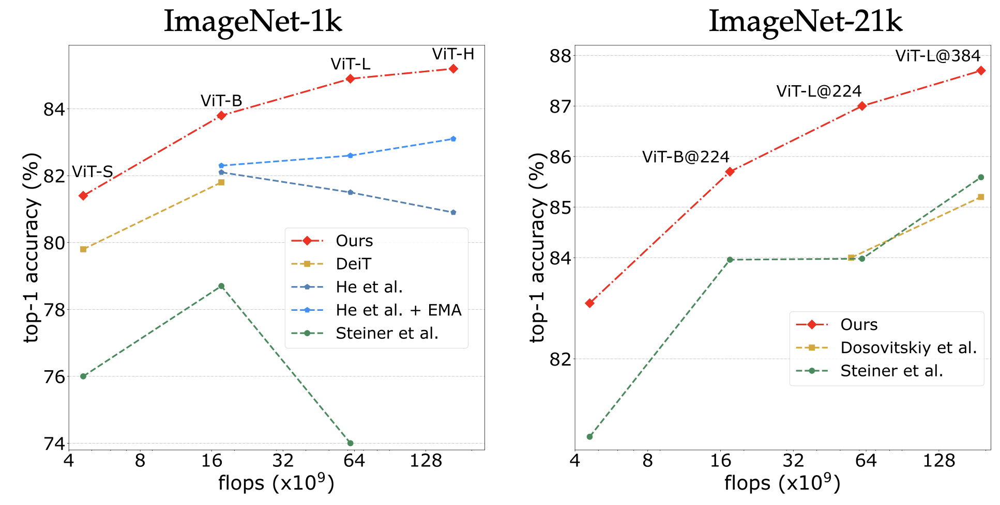
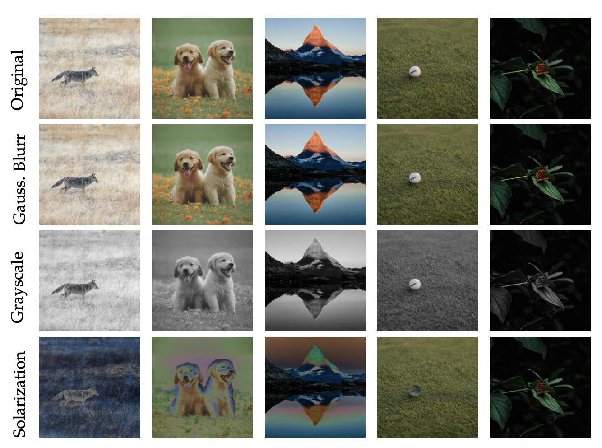

# DeiT III: Revenge of the ViT

This repository contains PyTorch evaluation code, training code and pretrained models for the following projects:
* [DeiT](README_deit.md) (Data-Efficient Image Transformers), ICML 2021 
* [CaiT](README_cait.md) (Going deeper with Image Transformers), ICCV 2021 (Oral)
* [ResMLP](README_resmlp.md) (ResMLP: Feedforward networks for image classification with data-efficient training)
* [PatchConvnet](README_patchconvnet.md) (Augmenting Convolutional networks with attention-based aggregation)
* [3Things](README_3things.md) (Three things everyone should know about Vision Transformers)
* DeiT III (DeiT III: Revenge of the ViT)


This new training recipes improve previous training strategy for ViT architectures:



For details see [DeiT III: Revenge of the ViT](https://arxiv.org/pdf/2204.07118.pdf) by Hugo Touvron, Matthieu Cord and Hervé Jégou. 

If you use this code for a paper please cite:

```
@article{Touvron2022DeiTIR,
  title={DeiT III: Revenge of the ViT},
  author={Hugo Touvron and Matthieu Cord and Herve Jegou},
  journal={arXiv preprint arXiv:2204.07118},
  year={2022},
}
```

# Model Zoo

We provide baseline ViT models pretrained on ImageNet-1k and ImageNet-21k.

## ImageNet-1k pre-training

| name | #params | GFLOPs | throughput (im/s) | Peak Mem (MB) | Resolution | acc@1 (INet-1k) | acc@1 (v2) | url |
| ---  | --- | --- | --- | --- | --- | --- | --- | --- |
| ViT-S | 22.0 | 4.6 | 1891 | 987 | 224x224 | 81.4 | 70.5 | [model](https://dl.fbaipublicfiles.com/deit/deit_3_small_224_1k.pth) |
| ViT-S | 22.0 | 15.5 | 424 | 4569 | 384x384 | 83.4 | 73.1 | [model](https://dl.fbaipublicfiles.com/deit/deit_3_small_384_1k.pth) |
| ViT-M | 38.8 | 8.0 | - | - | 224x224 | 83.0 | 72.3 | [model](https://dl.fbaipublicfiles.com/deit/deit_3_medium_224_1k.pth) |
| ViT-B | 86.6 | 17.5 | 831 | 2078 | 224x224 | 83.8 | 73.6 | [model](https://dl.fbaipublicfiles.com/deit/deit_3_base_224_1k.pth) |
| ViT-B | 86.9 | 55.5 | 190 | 8956 | 384x384 | 85.0 | 74.8 | [model](https://dl.fbaipublicfiles.com/deit/deit_3_base_384_1k.pth) |
| ViT-L | 304.4 | 61.6 | 277 | 3789 | 224x224 | 84.9 | 75.1 | [model](https://dl.fbaipublicfiles.com/deit/deit_3_large_224_1k.pth) |
| ViT-L | 304.8 | 191.2 | 67 | 12866 | 384x384 | 85.8 | 76.7 | [model](https://dl.fbaipublicfiles.com/deit/deit_3_large_384_1k.pth) |
| ViT-H | 632.1 | 167.4 | 112 | 6984 | 224x224 | 85.2 | 75.9 | [model](https://dl.fbaipublicfiles.com/deit/deit_3_huge_224_1k.pth) |


## ImageNet-21k pre-training

| name | #params | GFLOPs | throughput (im/s) | Peak Mem (MB) | Resolution | acc@1 (INet-1k) | acc@1 (v2) | url |
| ---  | --- | --- | --- | --- | --- | --- | --- | --- |
| ViT-S | 22.0 | 4.6 | 1891 | 987 | 224x224 | 83.1 | 73.8 | [model](https://dl.fbaipublicfiles.com/deit/deit_3_small_224_21k.pth) |
| ViT-S | 22.0 | 15.5 | 424 | 4569 | 384x384 | 84.8 | 75.1 |[model](https://dl.fbaipublicfiles.com/deit/deit_3_small_384_21k.pth) |
| ViT-M | 38.8 | 8.0 | - | - | 224x224 | 84.5 | 74.7 | [model](https://dl.fbaipublicfiles.com/deit/deit_3_medium_224_21k.pth) |
| ViT-B | 86.6 | 17.5 | 831 | 2078 | 224x224 | 85.7 | 76.5 | [model](https://dl.fbaipublicfiles.com/deit/deit_3_base_224_21k.pth) |
| ViT-B | 86.9 | 55.5 | 190 | 8956 | 384x384 | 86.7 | 77.9 | [model](https://dl.fbaipublicfiles.com/deit/deit_3_base_384_21k.pth) |
| ViT-L | 304.4 | 61.6 | 277 | 3789 | 224x224 | 87.0 | 78.6 | [model](https://dl.fbaipublicfiles.com/deit/deit_3_large_224_21k.pth) |
| ViT-L | 304.8 | 191.2 | 67 | 12866 | 384x384 | 87.7 | 79.1 | [model](https://dl.fbaipublicfiles.com/deit/deit_3_large_384_21k.pth) |
| ViT-H | 632.1 | 167.4 | 112 | 6984 | 224x224 | 87.2 | 79.2 | [model](https://dl.fbaipublicfiles.com/deit/deit_3_huge_224_21k_v1.pth) |

# 3-Augment

We use a simple data-augmentation ([3-Augment](augment.py)) strategy.




# Training command

### Multinode training

Distributed training is available via Slurm and [submitit](https://github.com/facebookincubator/submitit):

```
pip install submitit
```

Training on ImageNet-1k:

```
python run_with_submitit.py --model deit_small_patch16_LS --data-path /path/to/imagenet --batch 256 --lr 4e-3 --epochs 800 --weight-decay 0.05 --sched cosine --input-size 224 --eval-crop-ratio 1.0 --reprob 0.0 --nodes 1 --ngpus 8 --smoothing 0.0 --warmup-epochs 5 --drop 0.0 --nb-classes 1000 --seed 0 --opt fusedlamb --warmup-lr 1e-6 --mixup .8 --drop-path 0.05 --cutmix 1.0 --unscale-lr --repeated-aug--bce-loss  --color-jitter 0.3 --ThreeAugment
```
<details>
<summary>
  logs
</summary>

epoch 0: 0.1

epoch 5: 2.008

epoch 10: 9.258

epoch 15: 16.356

epoch 20: 24.752

epoch 25: 31.84

epoch 30: 38.52

epoch 35: 44.0

epoch 40: 48.034

epoch 45: 51.834

epoch 50: 53.628

epoch 55: 55.828

epoch 60: 57.12

epoch 65: 58.504

epoch 70: 59.218

epoch 75: 60.732

epoch 80: 60.98

epoch 85: 61.36

epoch 90: 61.842

epoch 95: 62.772

epoch 100: 63.122

epoch 105: 63.838

epoch 110: 63.902

epoch 115: 64.51

epoch 120: 64.822

epoch 125: 64.916

epoch 130: 65.518

epoch 135: 65.68

epoch 140: 65.796

epoch 145: 66.12

epoch 150: 66.18

epoch 155: 66.14

epoch 160: 66.666

epoch 165: 66.798

epoch 170: 66.974

epoch 175: 67.238

epoch 180: 67.446

epoch 185: 67.478

epoch 190: 67.656

epoch 195: 67.304

epoch 200: 67.9

epoch 205: 67.826

epoch 210: 68.372

epoch 215: 68.458

epoch 220: 68.764

epoch 225: 69.116

epoch 230: 69.016

epoch 235: 69.49

epoch 240: 69.296

epoch 245: 69.522

epoch 250: 69.678

epoch 255: 70.048

epoch 260: 69.648

epoch 265: 70.404

epoch 270: 70.232

epoch 275: 70.38

epoch 280: 70.726

epoch 285: 70.8

epoch 290: 70.844

epoch 295: 71.15

epoch 300: 71.56

epoch 305: 71.54

epoch 310: 71.538

epoch 315: 71.73

epoch 320: 72.144

epoch 325: 72.068

epoch 330: 72.182

epoch 335: 72.286

epoch 340: 72.434

epoch 345: 73.072

epoch 350: 72.998

epoch 355: 72.96

epoch 360: 73.062

epoch 365: 73.296

epoch 370: 73.85

epoch 375: 73.614

epoch 380: 73.934

epoch 385: 74.064

epoch 390: 74.35

epoch 395: 74.032

epoch 400: 74.446

epoch 405: 74.52

epoch 410: 74.736

epoch 415: 74.908

epoch 420: 75.154

epoch 425: 75.226

epoch 430: 75.556

epoch 435: 75.716

epoch 440: 75.612

epoch 445: 76.014

epoch 450: 75.798

epoch 455: 76.156

epoch 460: 76.268

epoch 465: 76.344

epoch 470: 76.656

epoch 475: 76.54

epoch 480: 76.572

epoch 485: 76.864

epoch 490: 77.142

epoch 495: 77.146

epoch 500: 77.664

epoch 505: 77.442

epoch 510: 77.72

epoch 515: 77.482

epoch 520: 77.788

epoch 525: 77.92

epoch 530: 78.172

epoch 535: 78.258

epoch 540: 78.44

epoch 545: 78.454

epoch 550: 78.522

epoch 555: 78.648

epoch 560: 78.574

epoch 565: 78.826

epoch 570: 78.874

epoch 575: 79.194

epoch 580: 78.97

epoch 585: 79.498

epoch 590: 79.432

epoch 595: 79.474

epoch 600: 79.6

epoch 605: 79.594

epoch 610: 79.934

epoch 615: 79.84

epoch 620: 79.916

epoch 625: 80.058

epoch 630: 80.038

epoch 635: 80.106

epoch 640: 80.302

epoch 645: 80.234

epoch 650: 80.388

epoch 655: 80.41

epoch 660: 80.47

epoch 665: 80.568

epoch 670: 80.57

epoch 675: 80.85

epoch 680: 80.862

epoch 685: 80.872

epoch 690: 80.918

epoch 695: 80.912

epoch 700: 81.012

epoch 705: 81.098

epoch 710: 81.042

epoch 715: 81.112

epoch 720: 81.154

epoch 725: 81.23

epoch 730: 81.118

epoch 735: 81.264

epoch 740: 81.24

epoch 745: 81.242

epoch 750: 81.21

epoch 755: 81.258

epoch 760: 81.342

epoch 765: 81.296

epoch 770: 81.33

epoch 775: 81.314

epoch 780: 81.312

epoch 785: 81.314

epoch 790: 81.334

epoch 795: 81.352

epoch 800: 81.376
</details>

```
python run_with_submitit.py --model deit_base_patch16_LS --data-path /path/to/imagenet --batch 256 --lr 3e-3 --epochs 800 --weight-decay 0.05 --sched cosine --input-size 192 --eval-crop-ratio 1.0 --reprob 0.0 --nodes 1 --ngpus 8 --smoothing 0.0 --warmup-epochs 5 --drop 0.0 --nb-classes 1000 --seed 0 --opt fusedlamb --warmup-lr 1e-6 --mixup .8 --drop-path 0.2 --cutmix 1.0 --unscale-lr --repeated-aug --bce-loss  --color-jitter 0.3 --ThreeAugment
```
<details>
<summary>
  logs
</summary>
  
epoch 0: 0.1

epoch 5: 2.838

epoch 10: 10.308

epoch 15: 17.292

epoch 20: 25.55

epoch 25: 33.436

epoch 30: 40.38

epoch 35: 45.446

epoch 40: 50.766

epoch 45: 54.162

epoch 50: 56.572

epoch 55: 58.8

epoch 60: 60.496

epoch 65: 61.994

epoch 70: 62.904

epoch 75: 64.06

epoch 80: 65.224

epoch 85: 65.718

epoch 90: 66.012

epoch 95: 66.984

epoch 100: 67.198

epoch 105: 67.864

epoch 110: 68.098

epoch 115: 68.568

epoch 120: 69.208

epoch 125: 69.448

epoch 130: 69.286

epoch 135: 69.568

epoch 140: 70.282

epoch 145: 70.396

epoch 150: 70.46

epoch 155: 70.844

epoch 160: 70.852

epoch 165: 71.33

epoch 170: 71.56

epoch 175: 71.784

epoch 180: 71.798

epoch 185: 72.162

epoch 190: 72.14

epoch 195: 72.082

epoch 200: 72.978

epoch 205: 72.562

epoch 210: 72.714

epoch 215: 73.006

epoch 220: 73.02

epoch 225: 73.466

epoch 230: 73.62

epoch 235: 73.656

epoch 240: 73.754

epoch 245: 73.718

epoch 250: 73.806

epoch 255: 74.182

epoch 260: 74.276

epoch 265: 74.592

epoch 270: 74.752

epoch 275: 74.86

epoch 280: 74.88

epoch 285: 75.044

epoch 290: 75.154

epoch 295: 75.482

epoch 300: 75.332

epoch 305: 75.548

epoch 310: 75.79

epoch 315: 75.832

epoch 320: 76.11

epoch 325: 76.27

epoch 330: 76.102

epoch 335: 76.556

epoch 340: 76.468

epoch 345: 76.514

epoch 350: 76.84

epoch 355: 77.128

epoch 360: 77.1

epoch 365: 76.99

epoch 370: 77.588

epoch 375: 77.336

epoch 380: 77.444

epoch 385: 77.924

epoch 390: 77.766

epoch 395: 77.756

epoch 400: 78.004

epoch 405: 78.238

epoch 410: 78.376

epoch 415: 78.45

epoch 420: 78.62

epoch 425: 78.628

epoch 430: 78.828

epoch 435: 78.92

epoch 440: 78.902

epoch 445: 78.994

epoch 450: 79.086

epoch 455: 79.206

epoch 460: 79.422

epoch 465: 79.394

epoch 470: 79.556

epoch 475: 79.736

epoch 480: 79.69

epoch 485: 79.978

epoch 490: 80.108

epoch 495: 80.162

epoch 500: 80.23

epoch 505: 80.346

epoch 510: 80.378

epoch 515: 80.488

epoch 520: 80.638

epoch 525: 80.666

epoch 530: 80.694

epoch 535: 80.798

epoch 540: 80.866

epoch 545: 81.024

epoch 550: 81.266

epoch 555: 81.028

epoch 560: 81.27

epoch 565: 81.306

epoch 570: 81.384

epoch 575: 81.474

epoch 580: 81.42

epoch 585: 81.53

epoch 590: 81.578

epoch 595: 81.726

epoch 600: 81.75

epoch 605: 81.672

epoch 610: 81.86

epoch 615: 82.006

epoch 620: 81.926

epoch 625: 81.806

epoch 630: 81.968

epoch 635: 82.104

epoch 640: 82.184

epoch 645: 82.202

epoch 650: 82.262

epoch 655: 82.224

epoch 660: 82.256

epoch 665: 82.284

epoch 670: 82.38

epoch 675: 82.438

epoch 680: 82.498

epoch 685: 82.554

epoch 690: 82.552

epoch 695: 82.648

epoch 700: 82.548

epoch 705: 82.702

epoch 710: 82.64

epoch 715: 82.598

epoch 720: 82.7

epoch 725: 82.686

epoch 730: 82.718

epoch 735: 82.71

epoch 740: 82.748

epoch 745: 82.784

epoch 750: 82.736

epoch 755: 82.77

epoch 760: 82.808

epoch 765: 82.754

epoch 770: 82.766

epoch 775: 82.798

epoch 780: 82.784

epoch 785: 82.802

epoch 790: 82.858

epoch 795: 82.866

epoch 800: 82.82
  
</details>
  
  
```
python run_with_submitit.py --model deit_large_patch16_LS --data-path /path/to/imagenet --batch 64 --lr 3e-3 --epochs 800 --weight-decay 0.05 --sched cosine --input-size 192 --eval-crop-ratio 1.0 --reprob 0.0 --nodes 4 --ngpus 8 --smoothing 0.0 --warmup-epochs 5 --drop 0.0 --nb-classes 1000 --seed 0 --opt fusedlamb --warmup-lr 1e-6 --mixup .8 --drop-path 0.45 --cutmix 1.0 --unscale-lr --repeated-aug --bce-loss  --color-jitter 0.3 --ThreeAugment
```
<details>
<summary>
  logs
</summary>
  
epoch 0: 0.092

epoch 5: 2.961

epoch 10: 9.847

epoch 15: 16.421

epoch 20: 24.51

epoch 25: 31.918

epoch 30: 39.016

epoch 35: 44.352

epoch 40: 49.568

epoch 45: 53.111

epoch 50: 55.806

epoch 55: 58.831

epoch 60: 60.379

epoch 65: 62.038

epoch 70: 63.162

epoch 75: 64.655

epoch 80: 65.499

epoch 85: 66.191

epoch 90: 66.557

epoch 95: 67.462

epoch 100: 68.096

epoch 105: 68.636

epoch 110: 68.924

epoch 115: 69.534

epoch 120: 70.024

epoch 125: 70.527

epoch 130: 70.783

epoch 135: 71.007

epoch 140: 71.211

epoch 145: 71.559

epoch 150: 71.819

epoch 155: 72.241

epoch 160: 72.095

epoch 165: 72.553

epoch 170: 72.945

epoch 175: 72.831

epoch 180: 73.313

epoch 185: 73.476

epoch 190: 73.534

epoch 195: 73.305

epoch 200: 73.85

epoch 205: 74.24

epoch 210: 74.34

epoch 215: 74.492

epoch 220: 74.67

epoch 225: 74.854

epoch 230: 74.94

epoch 235: 74.848

epoch 240: 75.082

epoch 245: 75.572

epoch 250: 75.698

epoch 255: 75.568

epoch 260: 75.948

epoch 265: 75.79

epoch 270: 76.116

epoch 275: 76.312

epoch 280: 76.322

epoch 285: 76.751

epoch 290: 76.891

epoch 295: 76.999

epoch 300: 77.251

epoch 305: 77.139

epoch 310: 77.207

epoch 315: 77.501

epoch 320: 77.467

epoch 325: 77.871

epoch 330: 77.689

epoch 335: 77.895

epoch 340: 78.013

epoch 345: 78.291

epoch 350: 78.295

epoch 355: 78.555

epoch 360: 78.877

epoch 365: 78.799

epoch 370: 79.163

epoch 375: 79.127

epoch 380: 79.319

epoch 385: 79.283

epoch 390: 79.239

epoch 395: 79.575

epoch 400: 79.617

epoch 405: 79.75

epoch 410: 79.95

epoch 415: 80.028

epoch 420: 80.21

epoch 425: 80.234

epoch 430: 80.42

epoch 435: 80.516

epoch 440: 80.802

epoch 445: 80.718

epoch 450: 80.878

epoch 455: 80.926

epoch 460: 81.118

epoch 465: 81.326

epoch 470: 81.298

epoch 475: 81.546

epoch 480: 81.626

epoch 485: 81.662

epoch 490: 81.624

epoch 495: 81.83

epoch 500: 81.854

epoch 505: 81.904

epoch 510: 82.192

epoch 515: 82.0

epoch 520: 82.112

epoch 525: 82.286

epoch 530: 82.318

epoch 535: 82.402

epoch 540: 82.514

epoch 545: 82.58

epoch 550: 82.626

epoch 555: 82.75

epoch 560: 82.762

epoch 565: 82.835

epoch 570: 83.019

epoch 575: 82.977

epoch 580: 83.033

epoch 585: 83.191

epoch 590: 83.145

epoch 595: 83.303

epoch 600: 83.313

epoch 605: 83.285

epoch 610: 83.443

epoch 615: 83.515

epoch 620: 83.517

epoch 625: 83.425

epoch 630: 83.487

epoch 635: 83.641

epoch 640: 83.635

epoch 645: 83.581

epoch 650: 83.667

epoch 655: 83.537

epoch 660: 83.669

epoch 665: 83.603

epoch 670: 83.775

epoch 675: 83.769

epoch 680: 83.703

epoch 685: 83.741

epoch 690: 83.737

epoch 695: 83.839

epoch 700: 83.873

epoch 705: 83.963

epoch 710: 83.929

epoch 715: 83.877

epoch 720: 83.919

epoch 725: 83.927

epoch 730: 83.943

epoch 735: 83.991

epoch 740: 84.037

epoch 745: 83.969

epoch 750: 83.941

epoch 755: 84.009

epoch 760: 84.009

epoch 765: 84.039

epoch 770: 84.047

epoch 775: 84.007

epoch 780: 83.995

epoch 785: 84.031

epoch 790: 84.031

epoch 795: 84.049

epoch 800: 84.024
  
</details>


```
python run_with_submitit.py --model deit_huge_patch14_LS --data-path /path/to/imagenet --batch 64 --lr 3e-3 --epochs 800 --weight-decay 0.05 --sched cosine --input-size 160 --eval-crop-ratio 1.0 --reprob 0.0 --nodes 4 --ngpus 8 --smoothing 0.0 --warmup-epochs 5 --drop 0.0 --nb-classes 1000 --seed 0 --opt fusedlamb --warmup-lr 1e-6 --mixup .8 --drop-path 0.6 --cutmix 1.0 --unscale-lr --repeated-aug --bce-loss  --color-jitter 0.3 --ThreeAugment
```
<details>
<summary>
  logs
</summary>
  
epoch 0: 0.062

epoch 5: 2.553

epoch 10: 8.143

epoch 15: 13.69

epoch 20: 19.48

epoch 25: 25.138

epoch 30: 30.98

epoch 35: 35.323

epoch 40: 40.369

epoch 45: 44.196

epoch 50: 47.299

epoch 55: 50.34

epoch 60: 52.623

epoch 65: 54.659

epoch 70: 56.062

epoch 75: 57.616

epoch 80: 58.977

epoch 85: 59.841

epoch 90: 60.899

epoch 95: 61.578

epoch 100: 62.444

epoch 105: 63.266

epoch 110: 63.598

epoch 115: 64.008

epoch 120: 64.867

epoch 125: 65.447

epoch 130: 65.621

epoch 135: 66.247

epoch 140: 66.597

epoch 145: 67.422

epoch 150: 67.266

epoch 155: 67.77

epoch 160: 67.966

epoch 165: 68.492

epoch 170: 68.84

epoch 175: 68.996

epoch 180: 69.322

epoch 185: 69.654

epoch 190: 69.816

epoch 195: 69.628

epoch 200: 70.276

epoch 205: 70.601

epoch 210: 70.879

epoch 215: 70.991

epoch 220: 71.069

epoch 225: 71.605

epoch 230: 71.439

epoch 235: 71.983

epoch 240: 72.033

epoch 245: 72.319

epoch 250: 72.567

epoch 255: 72.537

epoch 260: 73.025

epoch 265: 73.249

epoch 270: 73.205

epoch 275: 73.281

epoch 280: 73.556

epoch 285: 73.848

epoch 290: 73.974

epoch 295: 74.332

epoch 300: 74.044

epoch 305: 74.54

epoch 310: 74.576

epoch 315: 74.756

epoch 320: 75.01

epoch 325: 75.146

epoch 330: 75.42

epoch 335: 75.566

epoch 340: 75.764

epoch 345: 75.932

epoch 350: 76.132

epoch 355: 76.212

epoch 360: 76.426

epoch 365: 76.43

epoch 370: 76.953

epoch 375: 76.755

epoch 380: 77.125

epoch 385: 77.437

epoch 390: 77.227

epoch 395: 77.505

epoch 400: 77.715

epoch 405: 77.833

epoch 410: 77.801

epoch 415: 78.339

epoch 420: 78.231

epoch 425: 78.491

epoch 430: 78.541

epoch 435: 78.651

epoch 440: 78.877

epoch 445: 79.009

epoch 450: 79.079

epoch 455: 79.409

epoch 460: 79.365

epoch 465: 79.513

epoch 470: 79.782

epoch 475: 79.8

epoch 480: 79.938

epoch 485: 79.938

epoch 490: 80.01

epoch 495: 80.148

epoch 500: 80.348

epoch 505: 80.51

epoch 510: 80.79

epoch 515: 80.722

epoch 520: 80.72

epoch 525: 80.872

epoch 530: 81.276

epoch 535: 80.992

epoch 540: 81.354

epoch 545: 81.264

epoch 550: 81.312

epoch 555: 81.474

epoch 560: 81.46

epoch 565: 81.652

epoch 570: 81.634

epoch 575: 81.75

epoch 580: 81.868

epoch 585: 81.972

epoch 590: 81.924

epoch 595: 82.09

epoch 600: 82.236

epoch 605: 82.174

epoch 610: 82.36

epoch 615: 82.526

epoch 620: 82.47

epoch 625: 82.534

epoch 630: 82.678

epoch 635: 82.55

epoch 640: 82.716

epoch 645: 82.726

epoch 650: 82.825

epoch 655: 82.903

epoch 660: 82.913

epoch 665: 82.965

epoch 670: 83.003

epoch 675: 82.995

epoch 680: 82.989

epoch 685: 83.013

epoch 690: 83.047

epoch 695: 83.137

epoch 700: 83.241

epoch 705: 83.147

epoch 710: 83.207

epoch 715: 83.187

epoch 720: 83.307

epoch 725: 83.319

epoch 730: 83.371

epoch 735: 83.309

epoch 740: 83.259

epoch 745: 83.335

epoch 750: 83.389

epoch 755: 83.373

epoch 760: 83.357

epoch 765: 83.425

epoch 770: 83.367

epoch 775: 83.433

epoch 780: 83.387

epoch 785: 83.387

epoch 790: 83.449

epoch 795: 83.449

epoch 800: 83.484
</details>

finetuning for ViT-B, L and H at resolution 224x224:

```
python run_with_submitit.py --model deit_base_patch16_LS --data-path /path/to/imagenet --batch 64 --lr 1e-5 --epochs 20 --weight-decay 0.1 --sched cosine --input-size 224 --eval-crop-ratio 1.0 --reprob 0.0 --nodes 1 --ngpus 8 --smoothing 0.1 --warmup-epochs 5 --drop 0.0 --nb-classes 1000 --seed 0 --opt adamw --warmup-lr 1e-6 --mixup .8 --drop-path 0.2 --cutmix 1.0 --unscale-lr  --aa rand-m9-mstd0.5-inc1 --no-repeated-aug --finetune model_path
```

<details>
<summary>
  logs
</summary>
  
epoch 0: 83.448

epoch 5: 83.71

epoch 10: 83.788

epoch 15: 83.826

epoch 20: 83.802

</details>

```
python run_with_submitit.py --model deit_large_patch16_LS --data-path /path/to/imagenet --batch 64 --lr 1e-5 --epochs 20 --weight-decay 0.1 --sched cosine --input-size 224 --eval-crop-ratio 1.0 --reprob 0.0 --nodes 1 --ngpus 8 --smoothing 0.1 --warmup-epochs 5 --drop 0.0 --nb-classes 1000 --seed 0 --opt adamw --warmup-lr 1e-6 --mixup .8 --drop-path 0.45 --cutmix 1.0 --unscale-lr  --aa rand-m9-mstd0.5-inc1 --no-repeated-aug --finetune model_path
```

<details>
<summary>
  logs
</summary>
  
epoch 0: 84.458

epoch 5: 84.716

epoch 10: 84.826

epoch 15: 84.796

epoch 20: 84.862
  
</details>

```
python run_with_submitit.py --model deit_huge_patch14_LS --data-path /path/to/imagenet --batch 32 --lr 1e-5 --epochs 20 --weight-decay 0.1 --sched cosine --input-size 224 --eval-crop-ratio 1.0 --reprob 0.0 --nodes 2 --ngpus 8 --smoothing 0.1 --warmup-epochs 5 --drop 0.0 --nb-classes 1000 --seed 0 --opt adamw --warmup-lr 1e-6 --mixup .8 --drop-path 0.55 --cutmix 1.0 --unscale-lr  --aa rand-m9-mstd0.5-inc1 --no-repeated-aug --finetune model_path
```
<details>
<summary>
  logs
</summary>
  
epoch 0: 84.328

epoch 5: 85.028

epoch 10: 85.128

epoch 15: 85.184

epoch 20: 85.218
  
</details>

finetuning for ViT-S, B and L at resolution 384x384:

```
python run_with_submitit.py --model deit_small_patch16_LS --data-path /path/to/imagenet --batch 64 --lr 1e-5 --epochs 20 --weight-decay 0.1 --sched cosine --input-size 384 --eval-crop-ratio 1.0 --reprob 0.0 --nodes 1 --ngpus 8 --smoothing 0.1 --warmup-epochs 5 --drop 0.0 --nb-classes 1000 --seed 0 --opt adamw --warmup-lr 1e-6 --mixup .8 --drop-path 0.0 --cutmix 1.0 --unscale-lr --no-repeated-aug --aa rand-m9-mstd0.5-inc1 --finetune model_path
```
<details>
<summary>
  logs
</summary>
  
epoch 0: 82.134

epoch 5: 83.256

epoch 10: 83.452

epoch 15: 83.428

epoch 20: 83.422

</details>

```
python run_with_submitit.py --model deit_base_patch16_LS --data-path /path/to/imagenet --batch 32 --lr 1e-5 --epochs 20 --weight-decay 0.1 --sched cosine --input-size 384 --eval-crop-ratio 1.0 --reprob 0.0 --nodes 2 --ngpus 8 --smoothing 0.1 --warmup-epochs 5 --drop 0.0 --nb-classes 1000 --seed 0 --opt adamw --warmup-lr 1e-6 --mixup .8 --drop-path 0.15 --cutmix 1.0 --unscale-lr --no-repeated-aug --aa rand-m9-mstd0.5-inc1 --finetune model_path
```
<details>
<summary>
  logs
</summary>
  
epoch 0: 84.296

epoch 5: 84.968

epoch 10: 85.002

epoch 15: 84.986

epoch 20: 85.076 
  
</details>

```
python run_with_submitit.py --model deit_large_patch16_LS --data-path /path/to/imagenet --batch 16 --lr 1e-5 --epochs 20 --weight-decay 0.1 --sched cosine --input-size 384 --eval-crop-ratio 1.0 --reprob 0.0 --nodes 4 --ngpus 8 --smoothing 0.1 --warmup-epochs 5 --drop 0.0 --nb-classes 1000 --seed 0 --opt adamw --warmup-lr 1e-6 --mixup .8 --drop-path 0.4 --cutmix 1.0 --unscale-lr --no-repeated-aug --aa rand-m9-mstd0.5-inc1 --finetune model_path
```
<details>
<summary>
  logs
</summary>
  
epoch 0: 84.691

epoch 5: 85.458

epoch 10: 85.736

epoch 15: 85.794

epoch 20: 85.812
  
</details>

Training on ImageNet-21k:

It is possible to train with a batch size of 4096 with a learning rate of 0.0015 instead of 0.001.

```
python run_with_submitit.py --model deit_small_patch16_LS --data-path /path/to/imagenet --batch 128 --lr 0.001 --epochs 240 --weight-decay 0.02 --sched cosine --input-size 224 --eval-crop-ratio 1.0 --reprob 0.0 --nodes 2 --ngpus 8 --smoothing 0.1 --warmup-epochs 5 --drop 0.0 --nb-classes 1000 --seed 0 --opt fusedlamb --warmup-lr 1e-6 --mixup 0 --drop-path 0.05 --cutmix 1.0 --unscale-lr --no-repeated-aug   --color-jitter 0.3 --ThreeAugment --src
```

<details>
<summary>
  logs
</summary>
  
epoch 0: 0.0

epoch 5: 8.105

epoch 10: 32.78

epoch 15: 41.501

epoch 20: 44.226

epoch 25: 45.172

epoch 30: 45.991

epoch 35: 47.491

epoch 40: 47.151

epoch 45: 47.923

epoch 50: 48.327

epoch 55: 48.039

epoch 60: 48.325

epoch 65: 48.972

epoch 70: 49.1

epoch 75: 49.572

epoch 80: 49.368

epoch 85: 50.138

epoch 90: 49.82

epoch 95: 50.33

epoch 100: 50.748

epoch 105: 50.624

epoch 110: 50.63

epoch 115: 50.458

epoch 120: 51.13

epoch 125: 51.184

epoch 130: 51.871

epoch 135: 51.931

epoch 140: 51.791

epoch 145: 52.369

epoch 150: 52.409

epoch 155: 52.449

epoch 160: 52.499

epoch 165: 52.723

epoch 170: 53.267

epoch 175: 53.413

epoch 180: 53.373

epoch 185: 53.481

epoch 190: 53.321

epoch 195: 53.945

epoch 200: 53.913

epoch 205: 53.791

epoch 210: 54.111

epoch 215: 53.963

epoch 220: 54.057

epoch 225: 54.045

epoch 230: 54.107

epoch 235: 54.143

epoch 240: 54.12
  
</details>

```
python run_with_submitit.py --model deit_base_patch16_LS --data-path /path/to/imagenet --batch 64 --lr 0.001 --epochs 240 --weight-decay 0.02 --sched cosine --input-size 224 --eval-crop-ratio 1.0 --reprob 0.0 --nodes 4 --ngpus 8 --smoothing 0.1 --warmup-epochs 5 --drop 0.0 --nb-classes 1000 --seed 0 --opt fusedlamb --warmup-lr 1e-6 --mixup 0 --drop-path 0.1 --cutmix 1.0 --unscale-lr --no-repeated-aug   --color-jitter 0.3 --ThreeAugment --src
```
<details>
<summary>
  logs
</summary>

epoch 0: 0.0

epoch 5: 14.083

epoch 10: 40.471

epoch 15: 46.165

epoch 20: 48.88

epoch 25: 49.576

epoch 30: 50.562

epoch 35: 51.402

epoch 40: 51.681

epoch 45: 51.799

epoch 50: 52.783

epoch 55: 52.457

epoch 60: 52.675

epoch 65: 53.413

epoch 70: 53.029

epoch 75: 53.679

epoch 80: 53.265

epoch 85: 53.295

epoch 90: 53.811

epoch 95: 54.467

epoch 100: 54.223

epoch 105: 55.15

epoch 110: 55.112

epoch 115: 54.605

epoch 120: 54.826

epoch 125: 55.006

epoch 130: 55.244

epoch 135: 55.628

epoch 140: 55.344

epoch 145: 55.78

epoch 150: 55.896

epoch 155: 55.756

epoch 160: 56.002

epoch 165: 56.072

epoch 170: 56.472

epoch 175: 56.278

epoch 180: 56.442

epoch 185: 56.47

epoch 190: 56.298

epoch 195: 56.49

epoch 200: 56.64

epoch 205: 56.396

epoch 210: 56.678

epoch 215: 56.652

epoch 220: 56.444

epoch 225: 56.446

epoch 230: 56.512

epoch 235: 56.586

epoch 240: 56.462
  
</details>

```
python run_with_submitit.py --model deit_large_patch16_LS --data-path /path/to/imagenet --batch 64 --lr 0.001 --epochs 240 --weight-decay 0.02 --sched cosine --input-size 224 --eval-crop-ratio 1.0 --reprob 0.0 --nodes 4 --ngpus 8 --smoothing 0.1 --warmup-epochs 5 --drop 0.0 --nb-classes 1000 --seed 0 --opt fusedlamb --warmup-lr 1e-6 --mixup 0 --drop-path 0.3 --cutmix 1.0 --unscale-lr --no-repeated-aug   --color-jitter 0.3 --ThreeAugment --src
```

<details>
<summary>
  logs
</summary>
  
epoch 0: 0.0

epoch 5: 18.702

epoch 10: 43.678

epoch 15: 48.805

epoch 20: 51.103

epoch 25: 51.852

epoch 30: 52.725

epoch 35: 53.211

epoch 40: 53.82

epoch 45: 54.136

epoch 50: 55.141

epoch 55: 54.302

epoch 60: 55.085

epoch 65: 55.099

epoch 70: 55.113

epoch 75: 55.792

epoch 80: 55.493

epoch 85: 55.782

epoch 90: 55.567

epoch 95: 55.896

epoch 100: 56.132

epoch 105: 55.936

epoch 110: 56.498

epoch 115: 56.264

epoch 120: 56.45

epoch 125: 56.568

epoch 130: 56.734

epoch 135: 57.083

epoch 140: 56.915

epoch 145: 57.197

epoch 150: 56.999

epoch 155: 56.929

epoch 160: 57.211

epoch 165: 57.219

epoch 170: 57.623

epoch 175: 57.329

epoch 180: 57.243

epoch 185: 57.523

epoch 190: 57.257

epoch 195: 57.391

epoch 200: 57.343

epoch 205: 57.211

epoch 210: 57.437

epoch 215: 57.471

epoch 220: 57.481

epoch 225: 57.417

epoch 230: 57.439

epoch 235: 57.497

epoch 240: 57.412
  
</details>


```
python run_with_submitit.py --model deit_huge_patch14_LS --data-path /path/to/imagenet --batch 64 --lr 0.001 --epochs 90 --weight-decay 0.02 --sched cosine --input-size 128 --eval-crop-ratio 1.0 --reprob 0.0 --nodes 4 --ngpus 8 --smoothing 0.1 --warmup-epochs 5 --drop 0.0 --nb-classes 1000 --seed 0 --opt fusedlamb --warmup-lr 1e-6 --mixup 0 --drop-path 0.5 --cutmix 1.0 --unscale-lr --no-repeated-aug   --color-jitter 0.3 --ThreeAugment --src
```

<details>
<summary>
  logs
</summary>
  
epoch 0: 0.0

epoch 5: 31.292

epoch 10: 45.668

epoch 15: 48.563

epoch 20: 50.37

epoch 25: 51.143

epoch 30: 52.518

epoch 35: 53.205

epoch 40: 53.459

epoch 45: 54.482

epoch 50: 55.956

epoch 55: 55.872

epoch 60: 56.658

epoch 65: 57.173

epoch 70: 57.525

epoch 75: 57.882

epoch 80: 57.761

epoch 85: 58.006

epoch 90: 57.952
  
</details>

finetuning on ImageNet-1k:

```
python run_with_submitit.py --model deit_small_patch16_LS --data-path /path/to/imagenet --batch 128 --lr 0.0003 --epochs 50 --weight-decay 0.02 --sched cosine --input-size 224 --eval-crop-ratio 1.0 --reprob 0.0 --nodes 2 --ngpus 8 --smoothing 0.1 --warmup-epochs 5 --drop 0.0 --nb-classes 1000 --seed 0 --opt fusedlamb --warmup-lr 1e-6 --mixup 0 --drop-path 0.05 --cutmix 1.0 --unscale-lr --no-repeated-aug   --color-jitter 0.3 --ThreeAugment --src
```
<details>
<summary>
  logs
</summary>
  
epoch 0: 0.13

epoch 5: 79.023

epoch 10: 80.952

epoch 15: 81.68

epoch 20: 82.178

epoch 25: 82.436

epoch 30: 82.678

epoch 35: 82.925

epoch 40: 82.963

epoch 45: 83.053

epoch 50: 83.074
</details>


```
python run_with_submitit.py --model deit_base_patch16_LS --data-path /path/to/imagenet --batch 64 --lr 0.0003 --epochs 50 --weight-decay 0.02 --sched cosine --input-size 224 --eval-crop-ratio 1.0 --reprob 0.0 --nodes 4 --ngpus 8 --smoothing 0.1 --warmup-epochs 5 --drop 0.0 --nb-classes 1000 --seed 0 --opt fusedlamb --warmup-lr 1e-6 --mixup 0 --drop-path 0.15 --cutmix 1.0 --unscale-lr --no-repeated-aug   --color-jitter 0.3 --ThreeAugment --src
```

<details>
<summary>
  logs
</summary>
  
epoch 0: 0.11

epoch 5: 83.445

epoch 10: 84.677

epoch 15: 85.211

epoch 20: 85.265

epoch 25: 85.333

epoch 30: 85.437

epoch 35: 85.675

epoch 40: 85.671

epoch 45: 85.707

epoch 50: 85.698
  
</details>

```
python run_with_submitit.py --model deit_large_patch16_LS --data-path /path/to/imagenet --batch 64 --lr 0.0003 --epochs 50 --weight-decay 0.02 --sched cosine --input-size 224 --eval-crop-ratio 1.0 --reprob 0.0 --nodes 4 --ngpus 8 --smoothing 0.1 --warmup-epochs 5 --drop 0.0 --nb-classes 1000 --seed 0 --opt fusedlamb --warmup-lr 1e-6 --mixup 0 --drop-path 0.4 --cutmix 1.0 --unscale-lr --no-repeated-aug   --color-jitter 0.3 --ThreeAugment --src
```

<details>
<summary>
  logs
</summary>
  
epoch 0: 0.106

epoch 5: 85.427

epoch 10: 86.362

epoch 15: 86.624

epoch 20: 86.696

epoch 25: 86.826

epoch 30: 86.83

epoch 35: 86.954

epoch 40: 86.944

epoch 45: 86.934

epoch 50: 86.98
  
</details>

```
python run_with_submitit.py --model deit_huge_patch14_LS --data-path /path/to/imagenet --batch 64 --lr 0.0003 --epochs 50 --weight-decay 0.02 --sched cosine --input-size 224 --eval-crop-ratio 1.0 --reprob 0.0 --nodes 4 --ngpus 8 --smoothing 0.1 --warmup-epochs 5 --drop 0.0 --nb-classes 1000 --seed 0 --opt fusedlamb --warmup-lr 1e-6 --mixup 0 --drop-path 0.45 --cutmix 1.0 --unscale-lr --no-repeated-aug   --color-jitter 0.3 --ThreeAugment --src
```

<details>
<summary>
  logs
</summary>
  
epoch 0: 0.126

epoch 5: 84.681

epoch 10: 86.291

epoch 15: 86.753

epoch 20: 86.827

epoch 25: 86.903

epoch 30: 87.126

epoch 35: 87.056

epoch 40: 87.11

epoch 45: 87.154

epoch 50: 87.184
</details>

# License
This repository is released under the Apache 2.0 license as found in the [LICENSE](LICENSE) file.

# Contributing
We actively welcome your pull requests! Please see [CONTRIBUTING.md](.github/CONTRIBUTING.md) and [CODE_OF_CONDUCT.md](.github/CODE_OF_CONDUCT.md) for more info.

